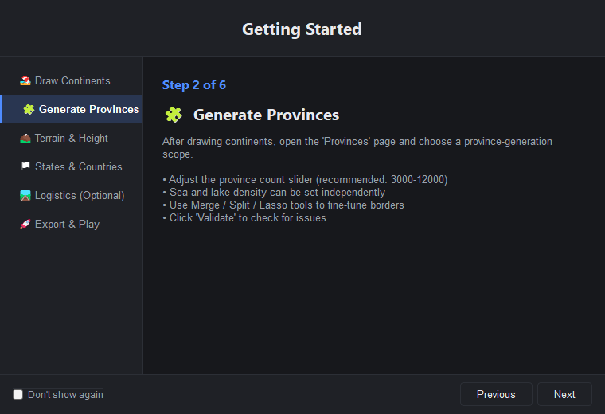
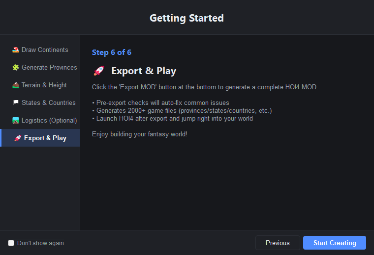

[English](README.md)

# HOI4 Map Maker

The application interface and generated messages are English-only.

**Build a complete Hearts of Iron IV total conversion MOD from scratch — no manual file editing required.**

HOI4 Map Maker is an open-source desktop map editor built with Python and PyQt5. It provides 12 editing modes covering the entire map creation workflow: draw continents, generate provinces, assign states and countries, and export 2000+ game files with one click. Launch HOI4 and play immediately.

> **Current Version**: v1.4.0 &nbsp;|&nbsp; **Tech Stack**: Python 3.10+ · PyQt5 · NumPy &nbsp;|&nbsp; **Platform**: Windows


### Screenshots

The following screenshots were regenerated from the current English-only UI.

**Welcome Page** — create, open, import, or learn with the built-in guide:

<p align="center">
  
</p>

**Tool Panel** — grouped map, region, logistics, preview, and settings navigation:

<p align="center">
  
</p>

**Getting Started Guide** — the six-step map workflow:

<p align="center">
  
</p>

**Export step** — the final onboarding screen explains preflight and playable output:

<p align="center">
  
</p>

---

## Features

### Map Drawing
- **Land / Sea / Lake** brush with brush, eraser, fill, transform, and pan tools
- Load vanilla map reference overlay or custom reference images
- Generate land, sea, and lake tiles plus rivers directly from color-coded full-map reference images (undoable)
- Choose detected reference-image colors in a visual role-mapping editor (land, sea, lake, province outlines, rivers) before generation
- 4 map sizes: 2048×1024 / 3072×1536 / 4096×2048 / 5632×2048

### Province System
- Voronoi + Lloyd relaxation auto-generation with adjustable density (separate sea/lake density)
- Manual province brush, new-province creation, and unassigned-area fill over reference images
- Manual edits and automatic/incremental generation operate on the same province map
- **Merge** / **Split** / **Lasso expand** tools for fine-tuning borders
- Import closed province outlines, automatically validate/repair them, or randomly split a multi-selection into a requested total number of connected provinces (undoable)
- Incremental regeneration (select a region to regenerate)
- Full-map diagnostics: X-crossings, tiny provinces, disconnected regions, coastal detection

### Terrain / Height / Rivers
- 10 terrain brushes: plains, forest, hills, mountains, desert, marsh, jungle, urban, ocean, lakes
- Smart terrain generation (height-based layering + noise boundaries + scatter patches)
- Smart heightmap generation (coastal distance field + Perlin noise mountains + smoothing)
- River drawing with 12 types following HOI4's strict color palette

### States / Countries / Regions
- Auto-generate states from provinces with population, category, and victory points
- Create countries with TAG, color, ruling party, and capital
- Continent assignment and strategic region management
- Logistics: adjacencies, railways, supply nodes
- **Quick Init**: one-click generation of states + strategic regions + default country

### One-Click Export
- Generates 2000+ HOI4 files: `provinces.bmp`, `definition.csv`, `heightmap.bmp`, `terrain.bmp`, `rivers.bmp`, state histories, country definitions, `buildings.txt`, supply networks, and more
- Pre-export validation with typed findings, repair proposals, and a shared GUI/CLI report
- Foundation, acceptance, scaffold, and `legacy_full` profiles with explicit content boundaries
- Transactional staging and immutable snapshots keep the live project unchanged during export
- Deterministic `foundation_manifest.json` output with source/output hashes and asset provenance
- Smart `replace_path` generation to avoid vanilla conflicts
- Export and launch — ready to play

### Foundation workflow
- Freeze province IDs, dimensions, state geography, topology, placements, and map-owned art with a versioned lock
- Compare later exports and classify breaking identity, topology, visual, placement, and non-foundation changes
- Run an isolated acceptance mod through start, tick, save, reload, and log checks
- Generate `FOUNDATION-HANDOFF.md` so content developers know what is stable and what belongs to scenario development

### Project Management
- Save / load `.hoi4proj` project files (zip format)
- Undo / redo with Command pattern (30-step history)
- English-only interface
- Import existing MOD maps
- Backward-compatible loading for legacy archives and `_manifest.txt` asset sidecars

---

## Quick Start

### From Source

```bash
git clone https://github.com/stuffi3000/hoi4-mod-maker.git
cd hoi4-mod-maker
pip install -r requirements.txt
python main.py
```

### Packaged Release

Download the `v1.4.0` package from [GitHub Releases](https://github.com/stuffi3000/hoi4-mod-maker/releases) when published, extract it, and run `HOI4MapMaker.exe`.

### Requirements

- Python 3.10+ (source only)
- Windows 10/11
- Dependencies: PyQt5, NumPy, Pillow, SciPy, OpenCV, pytest, pytest-qt, and PyQtDarkTheme2

### Development tests

Install the complete declared environment before collecting tests:

```bash
python -m pip install -r requirements.txt
python -m pytest -m "not slow and not game_install and not workshop and not engine"
```

The suite registers `unit`, `integration`, `slow`, `game_install`, `workshop`,
and `engine` markers. Game-install, Workshop, and engine checks are opt-in:

```bash
python -m pytest -m game_install
python -m pytest -m "slow and not game_install"
```

OpenCV and the other packages in `requirements.txt` are required development
dependencies; missing packages should be fixed with the install command rather
than hidden with broad test skips.

### CLI export exit codes

`python cli_export.py <project.hoi4proj> [output_dir]` uses stable result codes:

- `0` — export completed and final output verification passed;
- `1` — command, project-load, or writer failure;
- `2` — export ran, but final output validation found missing or empty required files.

The CLI configures UTF-8 output where supported and uses an ASCII-safe fallback
for Windows streams that cannot encode its status messages.

### Profile and foundation commands

Use the planner-backed CLI for new exports:

```bash
python cli_export.py projects/Belgium_Map_v1_1.hoi4proj out/foundation --profile foundation
python cli_export.py projects/Belgium_Map_v1_1.hoi4proj out/acceptance --profile acceptance
python tools/foundation_freeze.py --help
```

The foundation flow is candidate -> engine acceptance -> frozen lock ->
content handoff. See the [tutorial](docs/TUTORIAL.md), [map core contract](docs/wiki/map-core.md),
and [troubleshooting guide](docs/wiki/troubleshooting.md) for the exact
manifest, lock, and finding-code rules.

---

## Architecture

```
hoi4_map_maker/          224 files, 26,000 lines
├── model/               Data center (Project + EventBus)
├── domain/              Pure data layer (MapData + 8 Managers + generators)
├── commands/            Command pattern undo/redo (25 commands)
├── controllers/         13 business controllers (zero Qt dependency)
├── views/               Main window + canvas (input routing + overlays)
├── ui/                  Tool panel + dark theme + i18n
├── features/            12 map editing modes + 10 content modules (v2.0)
├── services/            Export / import / project services
├── export/              MOD exporter (writers organized by HOI4 directory)
├── data/                Constants + terrain definitions
├── app/                 DI container + feature registry
└── tests/               pytest test suite
```

**Pattern**: MVC + Command + EventBus

**Data flow**: User input → InputRouter → Controller → Command → MapData/Manager → EventBus → Feature renderer → Canvas refresh

## Development references

- [HOI4 wiki reference index](docs/wiki/README.md)
- [Tool export contract](docs/wiki/tool-export-contract.md)
- [Tutorial and foundation lifecycle](docs/TUTORIAL.md)
- [Map core contract](docs/wiki/map-core.md)
- [Buildings and supply review](docs/wiki/buildings-supply.md)
- [Troubleshooting and acceptance harness](docs/wiki/troubleshooting.md)
- [Map foundation readiness audit](docs/map-foundation-readiness-audit.md)
- [Map foundation performance baseline](docs/map-foundation-performance-baseline.md)
- [1.4.0 changelog](CHANGELOG.md)

---

## Roadmap

### v1.4 — Map foundation and release candidate ✅
- [x] Version-aware game/profile and project metadata
- [x] Immutable staged export profiles and shared validation reports
- [x] Adjacency, logistics, placement, and map-art review workflows
- [x] Assisted engine acceptance and exact-artifact foundation locks
- [x] Content handoff documentation and legacy migration adapters

### v1.0 — Map Editor ✅
- [x] Land / province / terrain / height / river editing
- [x] State / country / continent / strategic region management
- [x] Logistics (adjacencies / railways / supply nodes)
- [x] One-click export of playable MOD
- [x] Import existing MOD maps
- [x] English-only interface
- [x] Packaged `.exe` release

### v2.0 — Content Editor (Planned)
- [ ] Technology / focus tree editor
- [ ] Advisor / general / spy system
- [ ] Order of battle (OOB) editor
- [ ] Event / decision editor
- [ ] Ideas / namelist / portraits

---

## Credits

- **AmonStreeling** — original developer and creator of the project
- **Stuffi3000** — current developer of the fork and map-foundation release

---

## License

This project is licensed under the **GNU General Public License v3.0**.

- You may freely use, modify, and distribute this software
- MODs created with this tool are **not** subject to GPL
- Modified versions of the tool itself must be open-sourced under GPL
- See [LICENSE](LICENSE) for details

---

## Contributing

Issues and pull requests are welcome.

Code conventions:
- English comments
- `snake_case` functions / `CamelCase` classes
- Files under 800 lines
- NumPy vectorization — no Python loops for pixel operations
